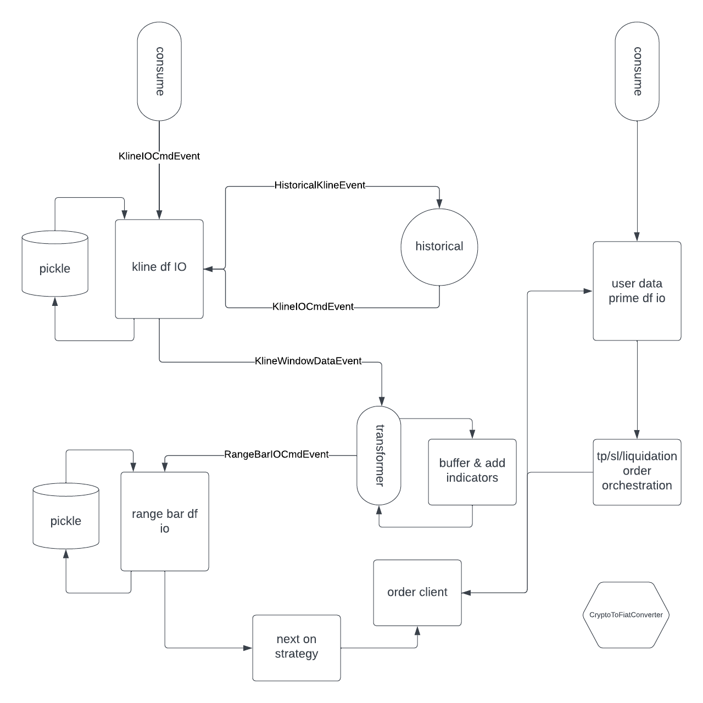

# Exploring Cryptocurrency Futures with Python: A Journey in Algorithmic Trading

## First Python Application

## Overview

This project originated from my desire to enhance my practical Python skills and understand how concepts from other programming languages could be applied to Python. As someone who had not previously engaged in live trading within the cryptocurrency futures market, I saw this as an intriguing challenge. While the initial strategy showed promise during backtesting, subsequent paper trading sessions exposed certain flaws. Identifying the precise issues remains pending, but the strategy's potential was demonstrated through historical data analysis via notebooks.

## Status

Currently, the project is in an unfinished state. I have chosen to maintain it as a repository to serve as a checkpoint in my journey of acquiring experiential knowledge in Python.

## Purpose

The core objective of this application is to establish a framework for executing a range bar strategy, specifically chosen for the volatile nature of the crypto market. However, discrepancies have been observed in how the derivative graph aligns with the real-time standard graph, indicating a need for further adjustments.

## Crypto Futures Market

For reference on the cryptocurrency futures market, see the Binance Futures API documentation: [Binance Futures API Docs](https://binance-docs.github.io/apidocs/futures/en/).

## Architecture Version 2

*Note: The diagram depicts the system architecture for this application, designed to provide clarity on its structural components.*

## To-Do List

- Implement offline protection for account administration. In case of failed orchestration, the system should retry until successful.
- Enable appending of buy and sell orders from the DataFrame to a CSV file for record-keeping.
- Incorporate measures to obscure the strategy pattern from potential external analysis, as discussed in "Lean Algorithm Trading" by Sebastien Donadio (Chapter 1, Page 25), to protect against counterintelligence.

## Notes and References

- For visual architecture planning, refer to our [Lucidchart diagram](https://lucid.app/lucidchart/73458ddb-e0f2-4dde-9e6e-c1772800c46e/edit?viewport_loc=28%2C-860%2C1707%2C811%2C0_0&invitationId=inv_4758b35a-2015-4977-bb89-6a140faee88e).
- This project utilizes Python 3.11.
- For type checking, the setting `python.analysis.typeCheckingMode` is configured to `basic` due to the difficulties encountered with the `strict` mode.
- Install necessary dependencies with `pip install -r requirements.txt`.
- Certain patterns, techniques, and modules were adapted from [Freqtrade](https://github.com/freqtrade/freqtrade).
- To bypass certain typing issues, use the following comment where necessary: `# type: ignore`.

